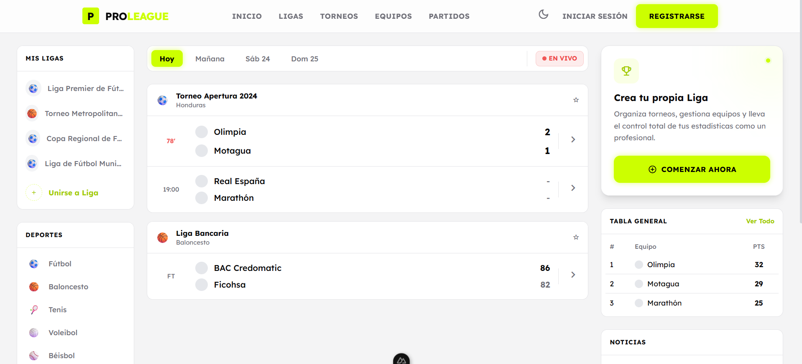
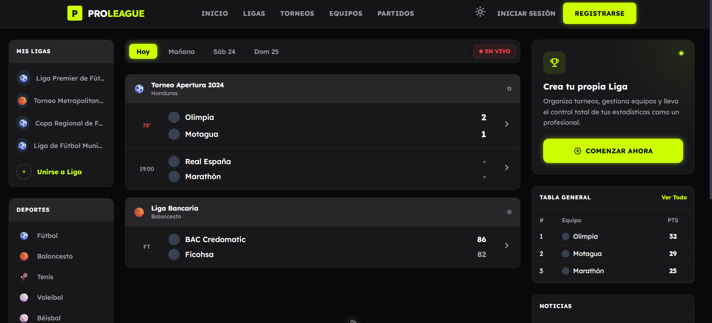
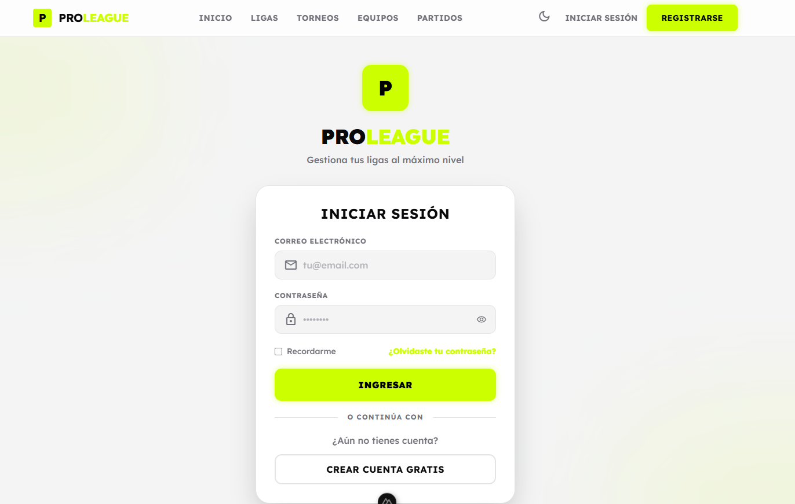
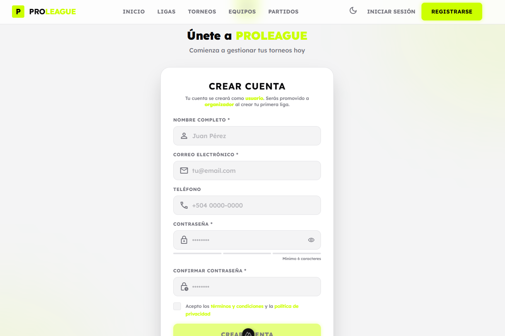
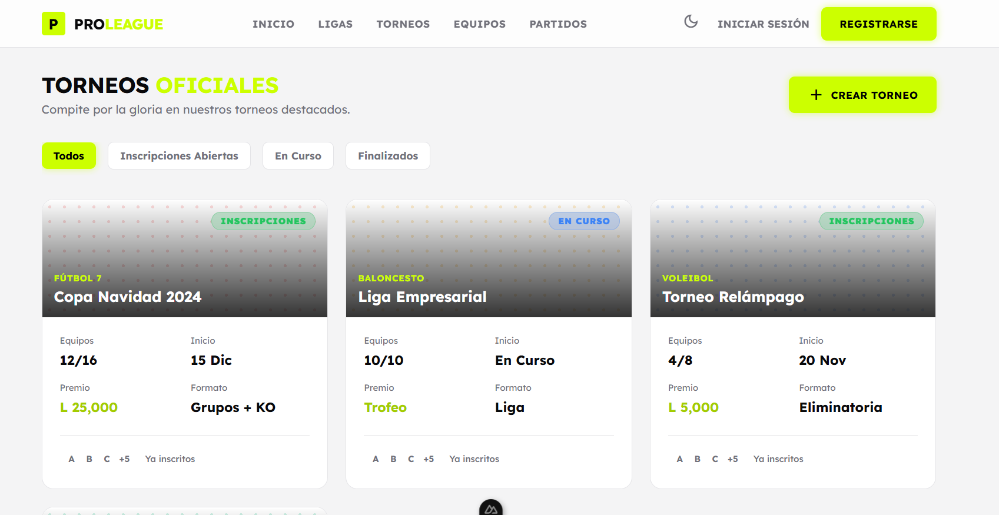

# Sistema de Gestión de Torneos

Este proyecto es una plataforma web para la gestión de ligas y torneos deportivos. Permite a los usuarios registrarse, crear ligas, gestionar equipos, programar partidos y visualizar tablas de posiciones.

## Tecnologías

- **Frontend:** Nuxt 3, Tailwind CSS, Pinia
- **Backend:** Node.js, Express, MySQL

## Instalación y Ejecución

Para correr el proyecto localmente, necesitas iniciar tanto el backend como el frontend.

### 1. Backend

```bash
cd backend
npm install
npm run dev
```

### 2. Frontend

```bash
cd frontend
npm install
npm run dev
```

El frontend estará disponible generalmente en `http://localhost:3000`.

## Capturas de Pantalla

### Página Principal



### Iniciar Sesión y Registro



### Torneos


### Equipos


### Partidos

